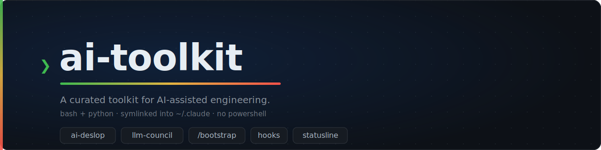
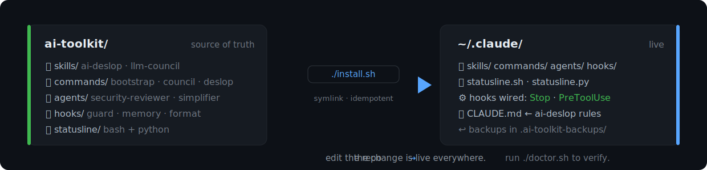
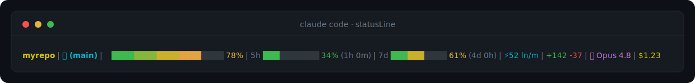

<p align="center">
  
</p>

<p align="center">
  <a href="https://github.com/koushik1610/ai-toolkit/actions/workflows/ci.yml"></a>
  &nbsp;
  &nbsp;
  &nbsp;
</p>

<p align="center">
  A curated collection of skills, councils, hooks, commands, and scaffolding for
  AI-assisted engineering.<br>
  The repo is the source of truth; <code>install.sh</code> symlinks it into
  <code>~/.claude</code>, so edits here are live.
</p>

---

## What's inside

| Tool | What it does |
|------|--------------|
| **conventions/** | The project-structure standard: a routing `CLAUDE.md` (under 150 lines), `WORKFLOW.md` (user stories), and a per-project memory layer. Templates included. |
| **skills/ai-deslop/** | Strips AI-generated tells from prose (no em-dashes, no corporate filler, no chatbot tone). On-demand skill plus always-on rules imported into the global `CLAUDE.md`. |
| **skills/llm-council/** | Configurable multi-persona review council. Lite (3 personas) or full (9 to 10 with anonymous voting), with priority, disposition, or score verdicts. Personas are a composable library. |
| **skills/\*-council/** | `security-council`, `portfolio-design-council`, `portfolio-resume-council`: thin wrappers that run the llm-council engine with a preset. |
| **commands/** | `/bootstrap` (scaffold a project), `/council` (convene the council, save the verdict), `/deslop` (clean a file or diff). |
| **agents/** | Curated subagents: `security-reviewer`, `simplifier`. |
| **hooks/** | `stop-memory-reminder`, `pretooluse-guard` (block destructive commands and secrets), `sessionstart-context`, `posttooluse-format` (opt-in). |
| **statusline/** | One-line truecolor status bar. `statusline.sh` (bash) and `statusline.py` (Python, cross-platform, no `jq`). |
| **archetypes/** | Bootstrap presets: `generic`, `startup-rag`, `mcp-server`, `single-tool`, `web-frontend`. |
| **tests/** | `bats` tests for the installer, the guard, and the status line. `shellcheck` plus a Python compile in CI. |

## How install works

<p align="center">
  
</p>

```bash
git clone git@github.com:koushik1610/ai-toolkit.git ~/Code/ai-toolkit
cd ~/Code/ai-toolkit
./install.sh            # symlink skills, commands, agents, hooks; wire global hooks
./install.sh --dry-run  # preview without changing anything
./doctor.sh             # verify every link and hook is healthy
./uninstall.sh          # reverse it
```

`install.sh` is idempotent and backs up anything real it would replace (into
`~/.claude/.ai-toolkit-backups/`). It requires `jq` for the settings merge and falls back to
printing manual instructions otherwise.

Installing wires two **global** hooks: a `Stop` memory nudge and a `PreToolUse` guard that
blocks destructive commands and obvious secrets. Bypass the guard for one call with
`AI_TOOLKIT_GUARD=off`. Treat it as a speed bump, not a replacement for git pre-commit
secret scanning.

## The status line

<p align="center">
  
</p>

Repo, git branch, a 20-block context-usage bar, 5h and weekly rate-limit bars, code velocity,
lines changed, model, and session cost. Pick `statusline.sh` for bash or `statusline.py` for a
single cross-platform script (and to drop the `jq` dependency). Enable it by pointing
`settings.json` at one of them. See [statusline/README.md](statusline/README.md).

## The council, briefly

A council is a panel of personas reviewing an ask or a project. Personas live one per file in
`skills/llm-council/personas/`. A council config (`skills/llm-council/councils/*.md`) picks
personas, a mode, a verdict format, and any gates. The security and portfolio councils are
configs of this one engine, so improving the engine improves all of them.

- **Lite:** 3 personas, no vote, fast. **Full:** 9 to 10 personas, anonymous peer vote, synthesis.
- **Verdicts:** `priority` (P0/P1/P2, default), `disposition` (APPROVE/CONDITIONAL/REJECT plus
  confidence), `score` (0 to 100 with a composite and floor gate).

See [skills/llm-council/SKILL.md](skills/llm-council/SKILL.md).

## Project structure standard

See [conventions/PROJECT-STRUCTURE.md](conventions/PROJECT-STRUCTURE.md). The short version:
`CLAUDE.md` routes, it does not dump. Detail lives in `.claude/rules/*.md`, user stories in
`WORKFLOW.md`, architecture in `docs/`. Run `/bootstrap` to scaffold it.
